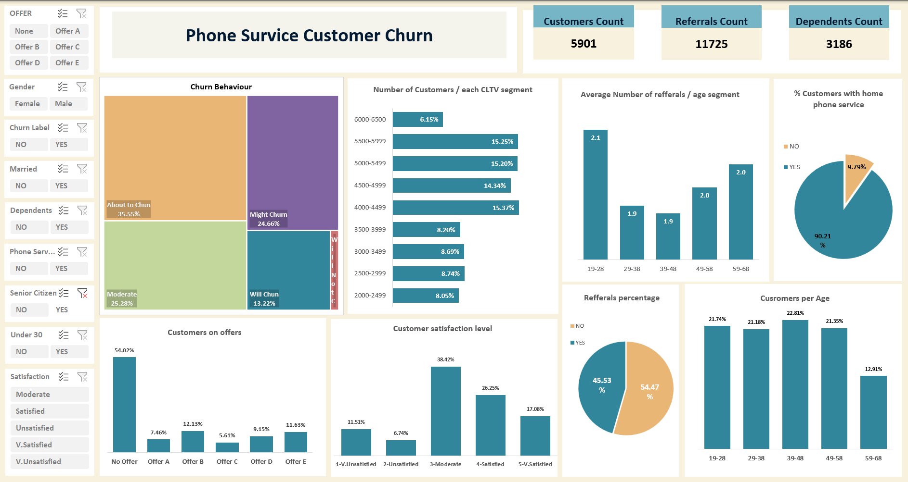
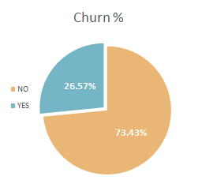

# Telecom Customers Churn Analysis using EXCEL

# Telecom Customers Churn

## Project target

data description: [https://www.kaggle.com/datasets/ylchang/telco-customer-churn-1113](https://www.kaggle.com/datasets/ylchang/telco-customer-churn-1113)

MY DASHBOARD :
[https://4t6fmp.sharepoint.com/❌/g/EcON--SIwspGs17Ie2yLaV4BnFKnbi1UmmmiAiAzvO_thQ?e=hZOAzh](https://4t6fmp.sharepoint.com/:x:/g/EcON--SIwspGs17Ie2yLaV4BnFKnbi1UmmmiAiAzvO_thQ?e=hZOAzh)


**Requirements:**

- Validate and clean data
- Manipulate data and communicate your insights
- Design a Dashboard
- What variables do you think significantly impact churn score? (consider using categorical data encoding)

# DATA VALIDATION AND CLEANING

### **CUSTOMER STATUS** sheet.

Checking for NULLS

- USING  Filtering and  function:

```jsx
=ISBLANK()
// To know the Number of blanks in a column
=COUNTIF(<ISBLANK() cell> = TRUE ) 
```

- “Churn Label” column has 5 “null values”, I filled them with

```jsx
=IFS(D2="Churned","YES",D2= "Stayed", "NO", D2 = "Joined", "NO")
```

- “Churn category” column has ***1872*** *NULLS* which are when the “churn Label” is “NO”

```jsx
=IFS(E2 = "NO", "No Churn", E2 = "YES", H2)
```

- “Churn Reason” column is like the “Churn category” column which has ***1872 NULLS*** which are when the “churn Label” column is “NO”

```jsx
=IFS($E2 = "NO", "No Churn", $E2 = "YES", I2)
```

### **CUSTOMER DEMOGRAPHICS** sheet.

Checking for NULLS

- USING  Filtering and  function:

```jsx
=ISBLANK()
// To know the Number of blanks in a column
=COUNTIF(<ISBLANK() cell> = TRUE ) 
```

- “under 30” column has some missing values so I’m going to fix it using the “Age” column

```jsx
=IF(C2<30,"YES","NO")
```

- “ Senior citizen” column Indicates if the customer is 65 or older: Yes, No. The column has some missing values which can be predicted using the “Age” column

```jsx
=IF(C2 >= 65, "YES", "NO")
```

- “Dependents” column Indicates the number of dependents lives with the customers, which can be children, parents, grandparents, etc. the Dependency can be predicted form the “number of dependents” column which is clean, has no NULLS, and sounds reasonable so it can be counted on to predict “dependent” column.

```jsx
=IF(H2<> 0, "YES" ,"NO")
```

### CUSTOMER LOCATION sheet.

- The sheet is clean, the number of the columns and  rows are as supposed to be, and contain no nulls.

### CUSTOMER SERVICE sheet.

Checking for NULLS

- USING  Filtering and  function:

```jsx
=ISBLANK()
// To know the Number of blanks in a column
=COUNTIF(<ISBLANK() cell> = TRUE ) 
```

**Referred a Friend:** Indicates if the customer has ever referred a friend or family member to this company: Yes, No

**Number of Referrals:** Indicates the number of referrals to date that the customer has made.

- **”Referred a Friend”** column Indicates if the customer has ever referred a friend or family member to this company: Yes, No which can be predicted easily using the **”Number of Referrals”** Column which which is clean, has no NULLS, and sounds reasonable so it can be counted on to predict the referral status.

```jsx
=IF(D2 <> 0, "YES", "NO") 
```

# DATA MANIBULATION

1. ***Feature Engineering*** on ***Satisfaction Score***
    
    
    | Satisfaction Score | Label |
    | --- | --- |
    | 1 | "Very Unsatisfied" |
    | 2 | "Unsatisfied" |
    | 3 | "Moderate" |
    | 4 | "Satisfied" |
    | 5 | "Very Satisfied" |
    
    ```jsx
    =IFS(D2 = 1, "Very Unsatisfied", D2 = 2, "Unsatisfied", D2 = 3, "Moderate", D2 = 4, "Satisfied", D2 = 5, "Very Satisfied")
    ```
    
2. ***Feature Engineering*** on ***Churn Score***
    
    
    | Churn Score | Label |
    | --- | --- |
    | 0 : 20 | "Will Not Churn" |
    | 20 : 40 | "Might  Churn" |
    | 40 : 60 | "Moderate" |
    | 60 : 80 | "About to Churn” |
    | 80 : 100 | "Will Churn" |
    
    ```jsx
    =IFS(AND(H2 >= 0, H2 <= 20), "Will Not Churn", AND(H2 > 20, H2 <= 40),"Might Churn", AND(H2 > 40, H2 <= 60), "Moderate", AND(H2 > 60, H2 <= 80), "About to Chun", AND(H2 > 80, H2 <= 100), "Will Chun")
    ```
    
3. ***Feature Engineering*** on ***CLTV***
    
    **CLTV:** Customer Lifetime Value. A predicted CLTV is calculated using corporate formulas and existing data. The higher the value, the more valuable the customer. High value customers should be monitored for churn.
    
    **CLTV Category:** A calculation that assigns a CLTV value to one of the following categories: 2000-2500, 2501-3000, 3001-3500, 3501-4000, 4001-4500, 4501-5000, 5001-5500, 5501-6000, 6001-6500, and 6501-7000.
    
    ```jsx
    =IFS(AND(I2 >= 2000, I2 <= 2500),"2000-2500", AND(I2 > 2500, I2 <= 3000),"2500-3000",AND(I2 > 3000, I2 <= 3500), "3000-3500",AND(I2 > 3500, I2 <= 4000), "3500-4000",AND(I2 > 4000, I2 <= 4500),"4000-4500",AND(I2 > 4500, I2 <= 5000),"4500-5000",AND(I2 >= 5000, I2 <= 5500), "5000-5500",AND(I2 > 5500, I2 <= 6000),"5500-6000",AND(I2 > 6000, I2 <= 6500),"6000-6500",AND(I2 > 6500, I2 <= 7000),"6500-7000")
    ```
    
4. ***VLOOKUP***() function is used a lot to ***Join*** the 4 sheets together so we can find the ***CORRELATION*** and Insert ***PIVOT TABLES*** to plot ***PIVOT CHARTS*** out of it and create a ***DASHBOARD***

1. highest city in churn 
2. Is there is a relation between age and churn 
3. relation ship between churn and gender 
4. CLTV top and bottom 
5. Most quarter has churn

# DASHBOARD

FILE LINK:

[https://4t6fmp.sharepoint.com/:x:/g/EcON--SIwspGs17Ie2yLaV4BnFKnbi1UmmmiAiAzvO_thQ?e=hZOAzh](https://4t6fmp.sharepoint.com/:x:/g/EcON--SIwspGs17Ie2yLaV4BnFKnbi1UmmmiAiAzvO_thQ?e=hZOAzh)

PICTURE:


 
# INSIGHTS

<aside>
💡 The Sample data Contains 7046 customers as the following chart says, 26.57% of them ***Churned*** form the company’s survives.



</aside>

<aside>
💡 Although the Satisfaction level is relatively High, as the following chart says but still the unsatisfied customers tends to churn as the previous chart shows.


</aside>

<aside>
💡 On the other side, 90.32% of the customers subscribes for both the internet and phone services. which can indicate customers’ loyalty for the company.


</aside>

<aside>
💡 The company seems to have customers from all age segments almost equally, except fore people above 65 which make sense as people at that age tends to lose interest in phones and internet.


</aside>

<aside>
💡 Although there is 5 different types of offers, there is over 55% of the customers are not on offers. That allows us to work on them more to get them to use more of the company’s services.


</aside>

<aside>
💡 The average referrals per each age segment is quite close varies from 1.82 to 2.02 which is very close range, although it is at it’s peak with ages 19 - 28


</aside>


# VARIABLES SIGNIFICANCE

after performing correlation for all of the categorical variables in the dataset, and visualizing the correlation using *CONDITIONAL FORMATING*


the darker colors specifies higher correlation
